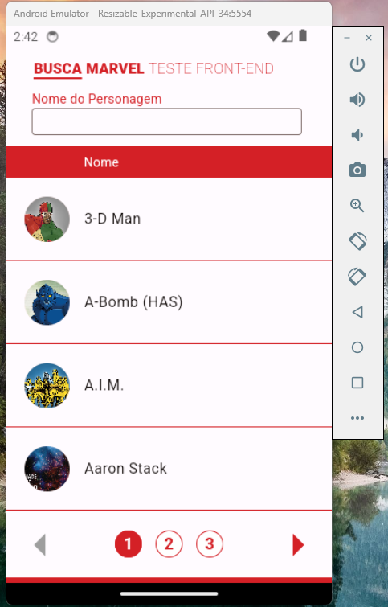
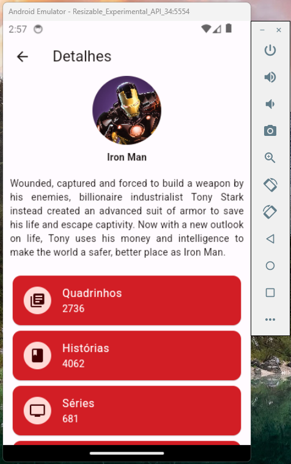

# Code Hero

Este é um projeto chamado Code Hero desenvolvido para mostrar as habilidades de desenvolvimento mobile em Flutter para a empresa Objective. A ideia por trás deste projeto era criar um aplicativo utilizando a API da Marvel para fornecer informações sobre os personagens, quadrinhos e séries da Marvel.

## Página Inicial 

A página inicial apresenta uma lista de super-heróis, oferecendo paginação e a opção de filtrar por nome.

## Detalhes dos Personagens

A página de detalhes exibe informações sobre o personagem, incluindo uma descrição, bem como o número de quadrinhos, histórias, séries e eventos associados.

